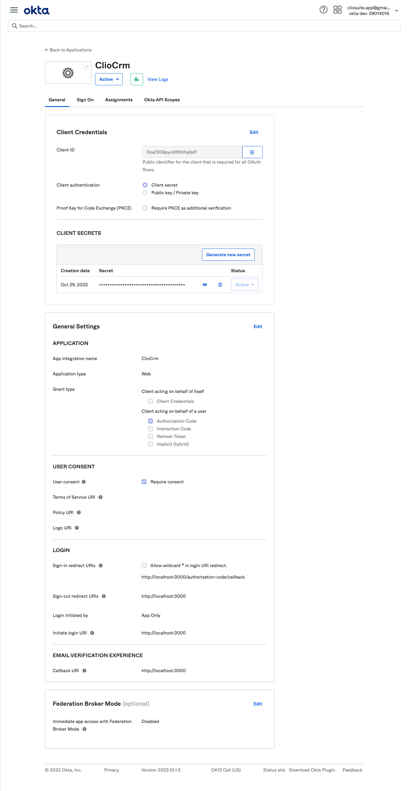

# Editing and extending ClioCollab, the sample Node JS application

This is an example of a simple web application with secure user authentication using Okta's [free developer account](https://developer.okta.com/signup/) and [ClioCRM's](https://cliosight.co#cliocrm) tables, forms, reports and triggers. Rest of the code includes examples of generic REST APIs. Use of ClioCRM's APIs are mentioned explicitly in the [documentation](https://cliosight.co#cliocrm) and code comments.

**Prerequisites**: [Node.js](https://nodejs.org/en/).

## Getting Started

To install this example application, run the following commands:

```bash
git clone https://github.com/cliocrm/cliocrm.git
cd cliocollab/okta-node-express-15-minute-auth-example-master 2/
npm install
```

This will install a local copy of the project. You will need to set up some environment variables before the app will run properly.

In order to check the current working of the application for a logged in user, use the credentials 

username: trial@cliocrm.co  
password: Lucky2022

If you wish to create your own Okta account to integrate Okta's Identity Platform for user authentication, you'll first need to:

* [Sign up for a free Okta Developer account](https://www.okta.com/developer/signup/)
* You will get a URL similar to `https://dev-123456.okta.com`.
  * Save this URL for later
  * You will also use this URL to login to your Okta account

You will need to create an application in Okta:

* Log in to your Okta account, then navigate to **Applications** and click the **Add Application** button
* Select **Web** and click **Next**
* Give your application a name (e.g. "ClioCRM Sample App")
* Change the **Base URI** to `http://localhost:3000/` and the **Login redirect URI** to `http://localhost:3000/callback`, then click **Done**
* Save your **Client ID** and **Client Secret** for later

Your Okta application should have settings similar to the following:



You will also need to create an API token in Okta:

* Log in to your Okta account, then navigate to **API > Tokens** and click the **Create Token** button
* Enter a name that will help you remember what this is used for (e.g. "ClioCRM Sample App")
* Save the provided **token value** for later
  * This will only be displayed once. If you lose it, you will need to create another API token

Now create a file called `.env` in the project root and add the following variables, replacing the values with your own from the previous steps.

**.env**
```bash
HOST_URL=http://localhost:3000
OKTA_ORG_URL=https://{yourOktaOrgUrl}
OKTA_CLIENT_ID={yourClientId}
OKTA_CLIENT_SECRET={yourClientSecret}
OKTA_TOKEN={yourOktaToken}
```

You also need an app secret. One way to get a random `APP_SECRET` is to use the following commands, which will generate a random value and add it to your `.env` file.

```bash
apt install uuid
npm install -g uuid-cli
echo "APP_SECRET=`uuid`" >> .env
```
You will need to install the dotenv module to start the application. Use the following command

```bash
npm install dotenv
```

Now you can run the web server with the following command:

```bash
npm start
```

## License

Apache 2.0, see [LICENSE](LICENSE).
